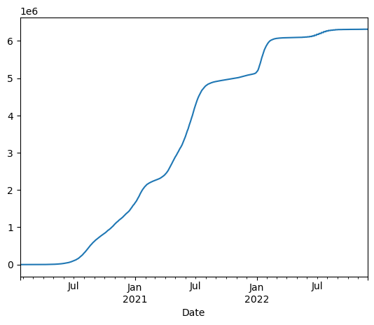
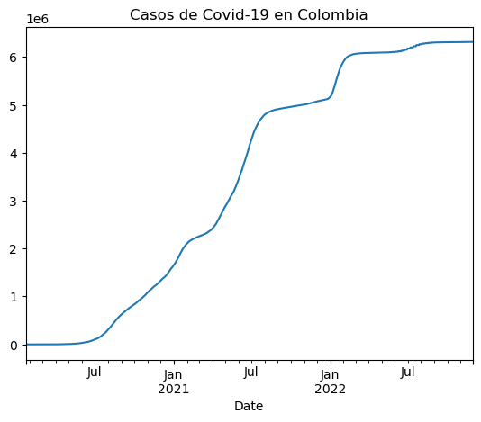

# Uso De la API del Covid-19 con Pandas
En la cuarta y última actividad dirigida, utilizaremos “Pandas”, una librería de Phython, para trabajar con datos de la Covid-19.
Esta es la URL: https://api.covid19api.com/countries

El ejercicio completo se puede encontrar en formato de cuaderno de Jupyter [en esta dirección](docs/ad4.ipynb).

## Instalación de librerías:
Para la instalación de las librerías usaremos la función !pip. La excavación se debe a que estamos ejecutando bash.


```python
!pip install pandas
```

    Requirement already satisfied: pandas in c:\users\erika\anaconda3\lib\site-packages (1.4.4)
    Requirement already satisfied: pytz>=2020.1 in c:\users\erika\anaconda3\lib\site-packages (from pandas) (2022.1)
    Requirement already satisfied: python-dateutil>=2.8.1 in c:\users\erika\anaconda3\lib\site-packages (from pandas) (2.8.2)
    Requirement already satisfied: numpy>=1.18.5 in c:\users\erika\anaconda3\lib\site-packages (from pandas) (1.21.5)
    Requirement already satisfied: six>=1.5 in c:\users\erika\anaconda3\lib\site-packages (from python-dateutil>=2.8.1->pandas) (1.16.0)
    

## Configuración de Pandas
Para importar utilizaremos la convención "pd" como abreviatura para llevar a la librería.


```python
import pandas as pd
```

## Crear variable
Las variables se asignan con el símbolo "=" y se redactará entrecomillado, ya que se trata de una cadena de caracteres. 


```python
miurl = "https://api.covid19api.com/countries"
```

Para saber cual es el valor de esta variable, en caso de querer conocerlo, tendremos que introducir el termino "miurl" y este tendrá que marcar un resultado igual a la url propuesta.


```python
miurl
```


    'https://api.covid19api.com/countries'


Si colocamos "miurl" dentro de un parentesis precedido por el comando "type", mostrará que se trata de una cadena de caracteres.


```python
type(miurl)
```


    str


## Empieza la magia de Pandas
### Crear dataframe
La abreviatura que se emplea para los dataframe es "dl". Existe una función "read_json()" que lee el formato "json". Dentro del paréntesis indicaremos el valor de lo que queremos que lea, en este caso la url. 


```python
df = pd.read_json(url)
```

Para visualizar los datos llamamos al objeto "df". Así, observamos una tabla que contiene tres columnas y una columna de control de Pandas, que identifica cada una de las entradas del dataframe.


```python
df
```


<div>
<style scoped>
    .dataframe tbody tr th:only-of-type {
        vertical-align: middle;
    }

    .dataframe tbody tr th {
        vertical-align: top;
    }

    .dataframe thead th {
        text-align: right;
    }
</style>
<table border="1" class="dataframe">
  <thead>
    <tr style="text-align: right;">
      <th></th>
      <th>Country</th>
      <th>Slug</th>
      <th>ISO2</th>
    </tr>
  </thead>
  <tbody>
    <tr>
      <th>0</th>
      <td>Angola</td>
      <td>angola</td>
      <td>AO</td>
    </tr>
    <tr>
      <th>1</th>
      <td>Georgia</td>
      <td>georgia</td>
      <td>GE</td>
    </tr>
    <tr>
      <th>2</th>
      <td>Ireland</td>
      <td>ireland</td>
      <td>IE</td>
    </tr>
    <tr>
      <th>3</th>
      <td>Slovenia</td>
      <td>slovenia</td>
      <td>SI</td>
    </tr>
    <tr>
      <th>4</th>
      <td>French Guiana</td>
      <td>french-guiana</td>
      <td>GF</td>
    </tr>
    <tr>
      <th>...</th>
      <td>...</td>
      <td>...</td>
      <td>...</td>
    </tr>
    <tr>
      <th>243</th>
      <td>Sri Lanka</td>
      <td>sri-lanka</td>
      <td>LK</td>
    </tr>
    <tr>
      <th>244</th>
      <td>Canada</td>
      <td>canada</td>
      <td>CA</td>
    </tr>
    <tr>
      <th>245</th>
      <td>Kuwait</td>
      <td>kuwait</td>
      <td>KW</td>
    </tr>
    <tr>
      <th>246</th>
      <td>Libya</td>
      <td>libya</td>
      <td>LY</td>
    </tr>
    <tr>
      <th>247</th>
      <td>Seychelles</td>
      <td>seychelles</td>
      <td>SC</td>
    </tr>
  </tbody>
</table>
<p>248 rows × 3 columns</p>
</div>


## Exploración de la tabla
Para ver las primeras entradas de la tabla, tendrémos que utilizar las siguientes funciones. Estas nos darán los seis primeros países en la tabla según su posición.


```python
df.head(6)
```


<div>
<style scoped>
    .dataframe tbody tr th:only-of-type {
        vertical-align: middle;
    }

    .dataframe tbody tr th {
        vertical-align: top;
    }

    .dataframe thead th {
        text-align: right;
    }
</style>
<table border="1" class="dataframe">
  <thead>
    <tr style="text-align: right;">
      <th></th>
      <th>Country</th>
      <th>Slug</th>
      <th>ISO2</th>
    </tr>
  </thead>
  <tbody>
    <tr>
      <th>0</th>
      <td>Angola</td>
      <td>angola</td>
      <td>AO</td>
    </tr>
    <tr>
      <th>1</th>
      <td>Georgia</td>
      <td>georgia</td>
      <td>GE</td>
    </tr>
    <tr>
      <th>2</th>
      <td>Ireland</td>
      <td>ireland</td>
      <td>IE</td>
    </tr>
    <tr>
      <th>3</th>
      <td>Slovenia</td>
      <td>slovenia</td>
      <td>SI</td>
    </tr>
    <tr>
      <th>4</th>
      <td>French Guiana</td>
      <td>french-guiana</td>
      <td>GF</td>
    </tr>
    <tr>
      <th>5</th>
      <td>Guam</td>
      <td>guam</td>
      <td>GU</td>
    </tr>
  </tbody>
</table>
</div>


La siguiente nos mostrará las seis últimas.


```python
df.tail(6)
```


<div>
<style scoped>
    .dataframe tbody tr th:only-of-type {
        vertical-align: middle;
    }

    .dataframe tbody tr th {
        vertical-align: top;
    }

    .dataframe thead th {
        text-align: right;
    }
</style>
<table border="1" class="dataframe">
  <thead>
    <tr style="text-align: right;">
      <th></th>
      <th>Country</th>
      <th>Slug</th>
      <th>ISO2</th>
    </tr>
  </thead>
  <tbody>
    <tr>
      <th>242</th>
      <td>Spain</td>
      <td>spain</td>
      <td>ES</td>
    </tr>
    <tr>
      <th>243</th>
      <td>Sri Lanka</td>
      <td>sri-lanka</td>
      <td>LK</td>
    </tr>
    <tr>
      <th>244</th>
      <td>Canada</td>
      <td>canada</td>
      <td>CA</td>
    </tr>
    <tr>
      <th>245</th>
      <td>Kuwait</td>
      <td>kuwait</td>
      <td>KW</td>
    </tr>
    <tr>
      <th>246</th>
      <td>Libya</td>
      <td>libya</td>
      <td>LY</td>
    </tr>
    <tr>
      <th>247</th>
      <td>Seychelles</td>
      <td>seychelles</td>
      <td>SC</td>
    </tr>
  </tbody>
</table>
</div>


Para conocer más información sobre las variables que contiene el dataframe habrá que utilizar la siguiente función.


```python
df.info()
```

    <class 'pandas.core.frame.DataFrame'>
    RangeIndex: 248 entries, 0 to 247
    Data columns (total 3 columns):
     #   Column   Non-Null Count  Dtype 
    ---  ------   --------------  ----- 
     0   Country  248 non-null    object
     1   Slug     248 non-null    object
     2   ISO2     248 non-null    object
    dtypes: object(3)
    memory usage: 5.9+ KB
    

Para mostrar una sola variable se utiliza la siguiente función. En este caso muestra el país.


```python
df['Country']
```


    0             Angola
    1            Georgia
    2            Ireland
    3           Slovenia
    4      French Guiana
               ...      
    243        Sri Lanka
    244           Canada
    245           Kuwait
    246            Libya
    247       Seychelles
    Name: Country, Length: 248, dtype: object


Lo mismo se puede realizar con la columna "Slug".


```python
df['Slug']
```


    0             angola
    1            georgia
    2            ireland
    3           slovenia
    4      french-guiana
               ...      
    243        sri-lanka
    244           canada
    245           kuwait
    246            libya
    247       seychelles
    Name: Slug, Length: 248, dtype: object


En caso de querer saber más sobre un valor en concreto, habrá que utilizar la siguiente función.


```python
df['Country'][40]
```


    'Haiti'


## Tiempo real
### Colombia
Para esta sección del trabajo, utilizaremos los datos en vivo, localizados en esta url: https://api.covid19api.com/country/colombia/status/confirmed/live

Guardaremos los datos de la misma manera en la que lo hicimos anteriormente, pero añadiendo "df_co" (la abreviatura de Colombia) para identificar que este dataframe es de este país en concreto.


```python
url_co = 'https://api.covid19api.com/country/colombia/status/confirmed/live'
df_co = pd.read_json(url_co)
df_co
```


<div>
<style scoped>
    .dataframe tbody tr th:only-of-type {
        vertical-align: middle;
    }

    .dataframe tbody tr th {
        vertical-align: top;
    }

    .dataframe thead th {
        text-align: right;
    }
</style>
<table border="1" class="dataframe">
  <thead>
    <tr style="text-align: right;">
      <th></th>
      <th>Country</th>
      <th>CountryCode</th>
      <th>Province</th>
      <th>City</th>
      <th>CityCode</th>
      <th>Lat</th>
      <th>Lon</th>
      <th>Cases</th>
      <th>Status</th>
      <th>Date</th>
    </tr>
  </thead>
  <tbody>
    <tr>
      <th>0</th>
      <td>Colombia</td>
      <td>CO</td>
      <td></td>
      <td></td>
      <td></td>
      <td>4.57</td>
      <td>-74.3</td>
      <td>0</td>
      <td>confirmed</td>
      <td>2020-01-22 00:00:00+00:00</td>
    </tr>
    <tr>
      <th>1</th>
      <td>Colombia</td>
      <td>CO</td>
      <td></td>
      <td></td>
      <td></td>
      <td>4.57</td>
      <td>-74.3</td>
      <td>0</td>
      <td>confirmed</td>
      <td>2020-01-23 00:00:00+00:00</td>
    </tr>
    <tr>
      <th>2</th>
      <td>Colombia</td>
      <td>CO</td>
      <td></td>
      <td></td>
      <td></td>
      <td>4.57</td>
      <td>-74.3</td>
      <td>0</td>
      <td>confirmed</td>
      <td>2020-01-24 00:00:00+00:00</td>
    </tr>
    <tr>
      <th>3</th>
      <td>Colombia</td>
      <td>CO</td>
      <td></td>
      <td></td>
      <td></td>
      <td>4.57</td>
      <td>-74.3</td>
      <td>0</td>
      <td>confirmed</td>
      <td>2020-01-25 00:00:00+00:00</td>
    </tr>
    <tr>
      <th>4</th>
      <td>Colombia</td>
      <td>CO</td>
      <td></td>
      <td></td>
      <td></td>
      <td>4.57</td>
      <td>-74.3</td>
      <td>0</td>
      <td>confirmed</td>
      <td>2020-01-26 00:00:00+00:00</td>
    </tr>
    <tr>
      <th>...</th>
      <td>...</td>
      <td>...</td>
      <td>...</td>
      <td>...</td>
      <td>...</td>
      <td>...</td>
      <td>...</td>
      <td>...</td>
      <td>...</td>
      <td>...</td>
    </tr>
    <tr>
      <th>1038</th>
      <td>Colombia</td>
      <td>CO</td>
      <td></td>
      <td></td>
      <td></td>
      <td>4.57</td>
      <td>-74.3</td>
      <td>6312657</td>
      <td>confirmed</td>
      <td>2022-11-25 00:00:00+00:00</td>
    </tr>
    <tr>
      <th>1039</th>
      <td>Colombia</td>
      <td>CO</td>
      <td></td>
      <td></td>
      <td></td>
      <td>4.57</td>
      <td>-74.3</td>
      <td>6312657</td>
      <td>confirmed</td>
      <td>2022-11-26 00:00:00+00:00</td>
    </tr>
    <tr>
      <th>1040</th>
      <td>Colombia</td>
      <td>CO</td>
      <td></td>
      <td></td>
      <td></td>
      <td>4.57</td>
      <td>-74.3</td>
      <td>6312657</td>
      <td>confirmed</td>
      <td>2022-11-27 00:00:00+00:00</td>
    </tr>
    <tr>
      <th>1041</th>
      <td>Colombia</td>
      <td>CO</td>
      <td></td>
      <td></td>
      <td></td>
      <td>4.57</td>
      <td>-74.3</td>
      <td>6312657</td>
      <td>confirmed</td>
      <td>2022-11-28 00:00:00+00:00</td>
    </tr>
    <tr>
      <th>1042</th>
      <td>Colombia</td>
      <td>CO</td>
      <td></td>
      <td></td>
      <td></td>
      <td>4.57</td>
      <td>-74.3</td>
      <td>6312657</td>
      <td>confirmed</td>
      <td>2022-11-29 00:00:00+00:00</td>
    </tr>
  </tbody>
</table>
<p>1043 rows × 10 columns</p>
</div>


## Explorar estos nuevos datos
Esta llamada tiene la capacidad de invocar todos los nombres que aparecen en las columnas.


```python
df_co.columns
```


    Index(['Country', 'CountryCode', 'Province', 'City', 'CityCode', 'Lat', 'Lon',
           'Cases', 'Status', 'Date'],
          dtype='object')


Si quisieramos ver la cabecera, tendríamos que introducir el siguiente comando. En este caso lo limitaremos a los primeros 10 valores.


```python
df_co.head(10)
```


<div>
<style scoped>
    .dataframe tbody tr th:only-of-type {
        vertical-align: middle;
    }

    .dataframe tbody tr th {
        vertical-align: top;
    }

    .dataframe thead th {
        text-align: right;
    }
</style>
<table border="1" class="dataframe">
  <thead>
    <tr style="text-align: right;">
      <th></th>
      <th>Country</th>
      <th>CountryCode</th>
      <th>Province</th>
      <th>City</th>
      <th>CityCode</th>
      <th>Lat</th>
      <th>Lon</th>
      <th>Cases</th>
      <th>Status</th>
      <th>Date</th>
    </tr>
  </thead>
  <tbody>
    <tr>
      <th>0</th>
      <td>Colombia</td>
      <td>CO</td>
      <td></td>
      <td></td>
      <td></td>
      <td>4.57</td>
      <td>-74.3</td>
      <td>0</td>
      <td>confirmed</td>
      <td>2020-01-22 00:00:00+00:00</td>
    </tr>
    <tr>
      <th>1</th>
      <td>Colombia</td>
      <td>CO</td>
      <td></td>
      <td></td>
      <td></td>
      <td>4.57</td>
      <td>-74.3</td>
      <td>0</td>
      <td>confirmed</td>
      <td>2020-01-23 00:00:00+00:00</td>
    </tr>
    <tr>
      <th>2</th>
      <td>Colombia</td>
      <td>CO</td>
      <td></td>
      <td></td>
      <td></td>
      <td>4.57</td>
      <td>-74.3</td>
      <td>0</td>
      <td>confirmed</td>
      <td>2020-01-24 00:00:00+00:00</td>
    </tr>
    <tr>
      <th>3</th>
      <td>Colombia</td>
      <td>CO</td>
      <td></td>
      <td></td>
      <td></td>
      <td>4.57</td>
      <td>-74.3</td>
      <td>0</td>
      <td>confirmed</td>
      <td>2020-01-25 00:00:00+00:00</td>
    </tr>
    <tr>
      <th>4</th>
      <td>Colombia</td>
      <td>CO</td>
      <td></td>
      <td></td>
      <td></td>
      <td>4.57</td>
      <td>-74.3</td>
      <td>0</td>
      <td>confirmed</td>
      <td>2020-01-26 00:00:00+00:00</td>
    </tr>
    <tr>
      <th>5</th>
      <td>Colombia</td>
      <td>CO</td>
      <td></td>
      <td></td>
      <td></td>
      <td>4.57</td>
      <td>-74.3</td>
      <td>0</td>
      <td>confirmed</td>
      <td>2020-01-27 00:00:00+00:00</td>
    </tr>
    <tr>
      <th>6</th>
      <td>Colombia</td>
      <td>CO</td>
      <td></td>
      <td></td>
      <td></td>
      <td>4.57</td>
      <td>-74.3</td>
      <td>0</td>
      <td>confirmed</td>
      <td>2020-01-28 00:00:00+00:00</td>
    </tr>
    <tr>
      <th>7</th>
      <td>Colombia</td>
      <td>CO</td>
      <td></td>
      <td></td>
      <td></td>
      <td>4.57</td>
      <td>-74.3</td>
      <td>0</td>
      <td>confirmed</td>
      <td>2020-01-29 00:00:00+00:00</td>
    </tr>
    <tr>
      <th>8</th>
      <td>Colombia</td>
      <td>CO</td>
      <td></td>
      <td></td>
      <td></td>
      <td>4.57</td>
      <td>-74.3</td>
      <td>0</td>
      <td>confirmed</td>
      <td>2020-01-30 00:00:00+00:00</td>
    </tr>
    <tr>
      <th>9</th>
      <td>Colombia</td>
      <td>CO</td>
      <td></td>
      <td></td>
      <td></td>
      <td>4.57</td>
      <td>-74.3</td>
      <td>0</td>
      <td>confirmed</td>
      <td>2020-01-31 00:00:00+00:00</td>
    </tr>
  </tbody>
</table>
</div>


Para ver los 8 últimos valores, insertaremos el siguiente comando.


```python
df_co.tail(8)
```


<div>
<style scoped>
    .dataframe tbody tr th:only-of-type {
        vertical-align: middle;
    }

    .dataframe tbody tr th {
        vertical-align: top;
    }

    .dataframe thead th {
        text-align: right;
    }
</style>
<table border="1" class="dataframe">
  <thead>
    <tr style="text-align: right;">
      <th></th>
      <th>Country</th>
      <th>CountryCode</th>
      <th>Province</th>
      <th>City</th>
      <th>CityCode</th>
      <th>Lat</th>
      <th>Lon</th>
      <th>Cases</th>
      <th>Status</th>
      <th>Date</th>
    </tr>
  </thead>
  <tbody>
    <tr>
      <th>1035</th>
      <td>Colombia</td>
      <td>CO</td>
      <td></td>
      <td></td>
      <td></td>
      <td>4.57</td>
      <td>-74.3</td>
      <td>6312657</td>
      <td>confirmed</td>
      <td>2022-11-22 00:00:00+00:00</td>
    </tr>
    <tr>
      <th>1036</th>
      <td>Colombia</td>
      <td>CO</td>
      <td></td>
      <td></td>
      <td></td>
      <td>4.57</td>
      <td>-74.3</td>
      <td>6312657</td>
      <td>confirmed</td>
      <td>2022-11-23 00:00:00+00:00</td>
    </tr>
    <tr>
      <th>1037</th>
      <td>Colombia</td>
      <td>CO</td>
      <td></td>
      <td></td>
      <td></td>
      <td>4.57</td>
      <td>-74.3</td>
      <td>6312657</td>
      <td>confirmed</td>
      <td>2022-11-24 00:00:00+00:00</td>
    </tr>
    <tr>
      <th>1038</th>
      <td>Colombia</td>
      <td>CO</td>
      <td></td>
      <td></td>
      <td></td>
      <td>4.57</td>
      <td>-74.3</td>
      <td>6312657</td>
      <td>confirmed</td>
      <td>2022-11-25 00:00:00+00:00</td>
    </tr>
    <tr>
      <th>1039</th>
      <td>Colombia</td>
      <td>CO</td>
      <td></td>
      <td></td>
      <td></td>
      <td>4.57</td>
      <td>-74.3</td>
      <td>6312657</td>
      <td>confirmed</td>
      <td>2022-11-26 00:00:00+00:00</td>
    </tr>
    <tr>
      <th>1040</th>
      <td>Colombia</td>
      <td>CO</td>
      <td></td>
      <td></td>
      <td></td>
      <td>4.57</td>
      <td>-74.3</td>
      <td>6312657</td>
      <td>confirmed</td>
      <td>2022-11-27 00:00:00+00:00</td>
    </tr>
    <tr>
      <th>1041</th>
      <td>Colombia</td>
      <td>CO</td>
      <td></td>
      <td></td>
      <td></td>
      <td>4.57</td>
      <td>-74.3</td>
      <td>6312657</td>
      <td>confirmed</td>
      <td>2022-11-28 00:00:00+00:00</td>
    </tr>
    <tr>
      <th>1042</th>
      <td>Colombia</td>
      <td>CO</td>
      <td></td>
      <td></td>
      <td></td>
      <td>4.57</td>
      <td>-74.3</td>
      <td>6312657</td>
      <td>confirmed</td>
      <td>2022-11-29 00:00:00+00:00</td>
    </tr>
  </tbody>
</table>
</div>


Para conocer la información de esta variable, añadiremos el siguiente comando.


```python
df_co.info()
```

    <class 'pandas.core.frame.DataFrame'>
    RangeIndex: 1043 entries, 0 to 1042
    Data columns (total 10 columns):
     #   Column       Non-Null Count  Dtype              
    ---  ------       --------------  -----              
     0   Country      1043 non-null   object             
     1   CountryCode  1043 non-null   object             
     2   Province     1043 non-null   object             
     3   City         1043 non-null   object             
     4   CityCode     1043 non-null   object             
     5   Lat          1043 non-null   float64            
     6   Lon          1043 non-null   float64            
     7   Cases        1043 non-null   int64              
     8   Status       1043 non-null   object             
     9   Date         1043 non-null   datetime64[ns, UTC]
    dtypes: datetime64[ns, UTC](1), float64(2), int64(1), object(6)
    memory usage: 81.6+ KB
    

Para obtener una descripción estadística de las variables numéricas del dataframe (obtenemos el número total, la media, la desviación, el mínimo y mácimo y los cuartiles):


```python
df_co.describe()
```


<div>
<style scoped>
    .dataframe tbody tr th:only-of-type {
        vertical-align: middle;
    }

    .dataframe tbody tr th {
        vertical-align: top;
    }

    .dataframe thead th {
        text-align: right;
    }
</style>
<table border="1" class="dataframe">
  <thead>
    <tr style="text-align: right;">
      <th></th>
      <th>Lat</th>
      <th>Lon</th>
      <th>Cases</th>
    </tr>
  </thead>
  <tbody>
    <tr>
      <th>count</th>
      <td>1.043000e+03</td>
      <td>1.043000e+03</td>
      <td>1.043000e+03</td>
    </tr>
    <tr>
      <th>mean</th>
      <td>4.570000e+00</td>
      <td>-7.430000e+01</td>
      <td>3.433010e+06</td>
    </tr>
    <tr>
      <th>std</th>
      <td>1.954930e-14</td>
      <td>1.464420e-12</td>
      <td>2.436987e+06</td>
    </tr>
    <tr>
      <th>min</th>
      <td>4.570000e+00</td>
      <td>-7.430000e+01</td>
      <td>0.000000e+00</td>
    </tr>
    <tr>
      <th>25%</th>
      <td>4.570000e+00</td>
      <td>-7.430000e+01</td>
      <td>8.902395e+05</td>
    </tr>
    <tr>
      <th>50%</th>
      <td>4.570000e+00</td>
      <td>-7.430000e+01</td>
      <td>4.126340e+06</td>
    </tr>
    <tr>
      <th>75%</th>
      <td>4.570000e+00</td>
      <td>-7.430000e+01</td>
      <td>6.077054e+06</td>
    </tr>
    <tr>
      <th>max</th>
      <td>4.570000e+00</td>
      <td>-7.430000e+01</td>
      <td>6.312657e+06</td>
    </tr>
  </tbody>
</table>
</div>


## Elaboración de un gráfico
Para elaborar un gráfico que contenga la fecha en el eje X y los casos confinados en el eje Y, estableceremos la fecha como índice de la función. 

Esto hará que las entradas se identifiquen por la fecha y no por el índice que le había dado Pandas en un principio.


```python
df_co.set_index('Date')
```


<div>
<style scoped>
    .dataframe tbody tr th:only-of-type {
        vertical-align: middle;
    }

    .dataframe tbody tr th {
        vertical-align: top;
    }

    .dataframe thead th {
        text-align: right;
    }
</style>
<table border="1" class="dataframe">
  <thead>
    <tr style="text-align: right;">
      <th></th>
      <th>Country</th>
      <th>CountryCode</th>
      <th>Province</th>
      <th>City</th>
      <th>CityCode</th>
      <th>Lat</th>
      <th>Lon</th>
      <th>Cases</th>
      <th>Status</th>
    </tr>
    <tr>
      <th>Date</th>
      <th></th>
      <th></th>
      <th></th>
      <th></th>
      <th></th>
      <th></th>
      <th></th>
      <th></th>
      <th></th>
    </tr>
  </thead>
  <tbody>
    <tr>
      <th>2020-01-22 00:00:00+00:00</th>
      <td>Colombia</td>
      <td>CO</td>
      <td></td>
      <td></td>
      <td></td>
      <td>4.57</td>
      <td>-74.3</td>
      <td>0</td>
      <td>confirmed</td>
    </tr>
    <tr>
      <th>2020-01-23 00:00:00+00:00</th>
      <td>Colombia</td>
      <td>CO</td>
      <td></td>
      <td></td>
      <td></td>
      <td>4.57</td>
      <td>-74.3</td>
      <td>0</td>
      <td>confirmed</td>
    </tr>
    <tr>
      <th>2020-01-24 00:00:00+00:00</th>
      <td>Colombia</td>
      <td>CO</td>
      <td></td>
      <td></td>
      <td></td>
      <td>4.57</td>
      <td>-74.3</td>
      <td>0</td>
      <td>confirmed</td>
    </tr>
    <tr>
      <th>2020-01-25 00:00:00+00:00</th>
      <td>Colombia</td>
      <td>CO</td>
      <td></td>
      <td></td>
      <td></td>
      <td>4.57</td>
      <td>-74.3</td>
      <td>0</td>
      <td>confirmed</td>
    </tr>
    <tr>
      <th>2020-01-26 00:00:00+00:00</th>
      <td>Colombia</td>
      <td>CO</td>
      <td></td>
      <td></td>
      <td></td>
      <td>4.57</td>
      <td>-74.3</td>
      <td>0</td>
      <td>confirmed</td>
    </tr>
    <tr>
      <th>...</th>
      <td>...</td>
      <td>...</td>
      <td>...</td>
      <td>...</td>
      <td>...</td>
      <td>...</td>
      <td>...</td>
      <td>...</td>
      <td>...</td>
    </tr>
    <tr>
      <th>2022-11-25 00:00:00+00:00</th>
      <td>Colombia</td>
      <td>CO</td>
      <td></td>
      <td></td>
      <td></td>
      <td>4.57</td>
      <td>-74.3</td>
      <td>6312657</td>
      <td>confirmed</td>
    </tr>
    <tr>
      <th>2022-11-26 00:00:00+00:00</th>
      <td>Colombia</td>
      <td>CO</td>
      <td></td>
      <td></td>
      <td></td>
      <td>4.57</td>
      <td>-74.3</td>
      <td>6312657</td>
      <td>confirmed</td>
    </tr>
    <tr>
      <th>2022-11-27 00:00:00+00:00</th>
      <td>Colombia</td>
      <td>CO</td>
      <td></td>
      <td></td>
      <td></td>
      <td>4.57</td>
      <td>-74.3</td>
      <td>6312657</td>
      <td>confirmed</td>
    </tr>
    <tr>
      <th>2022-11-28 00:00:00+00:00</th>
      <td>Colombia</td>
      <td>CO</td>
      <td></td>
      <td></td>
      <td></td>
      <td>4.57</td>
      <td>-74.3</td>
      <td>6312657</td>
      <td>confirmed</td>
    </tr>
    <tr>
      <th>2022-11-29 00:00:00+00:00</th>
      <td>Colombia</td>
      <td>CO</td>
      <td></td>
      <td></td>
      <td></td>
      <td>4.57</td>
      <td>-74.3</td>
      <td>6312657</td>
      <td>confirmed</td>
    </tr>
  </tbody>
</table>
<p>1043 rows × 9 columns</p>
</div>


Para añadir los casos confirmados se utilizará el siguiente comando. 


```python
df_co.set_index('Date')['Cases']
```


    Date
    2020-01-22 00:00:00+00:00          0
    2020-01-23 00:00:00+00:00          0
    2020-01-24 00:00:00+00:00          0
    2020-01-25 00:00:00+00:00          0
    2020-01-26 00:00:00+00:00          0
                                  ...   
    2022-11-25 00:00:00+00:00    6312657
    2022-11-26 00:00:00+00:00    6312657
    2022-11-27 00:00:00+00:00    6312657
    2022-11-28 00:00:00+00:00    6312657
    2022-11-29 00:00:00+00:00    6312657
    Name: Cases, Length: 1043, dtype: int64


Con esto crearemos el gráfico con la función "plot", palabra utilizada para que se genere uno.


```python
df_co.set_index('Date')['Cases'].plot()
```


    <AxesSubplot:xlabel='Date'>


    

    


Para asignarle un nombre, utilizaremos el atributo "title".


```python
df_co.set_index('Date')['Cases'].plot(title= "Casos de Covid-19 en Colombia")
```


    <AxesSubplot:title={'center':'Casos de Covid-19 en Colombia'}, xlabel='Date'>


    

    


Para completar este ejercicio, estos pasos se repetirán para Ecuador, República Dominicana y España. Esto se puede observar [en este archivo](docs/ad4.ipynb)
